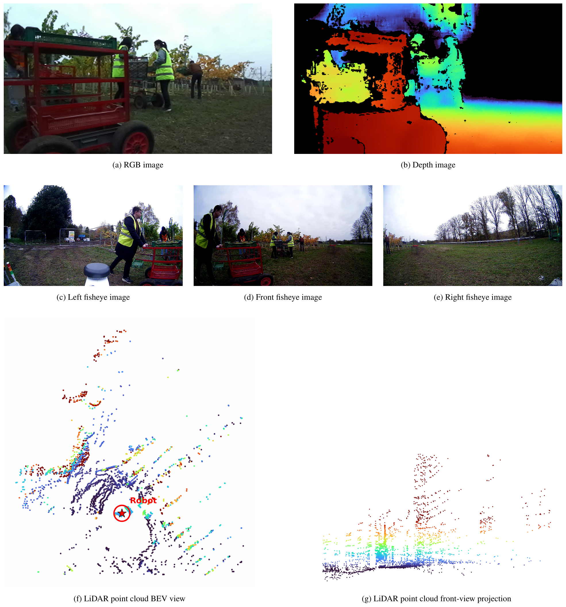
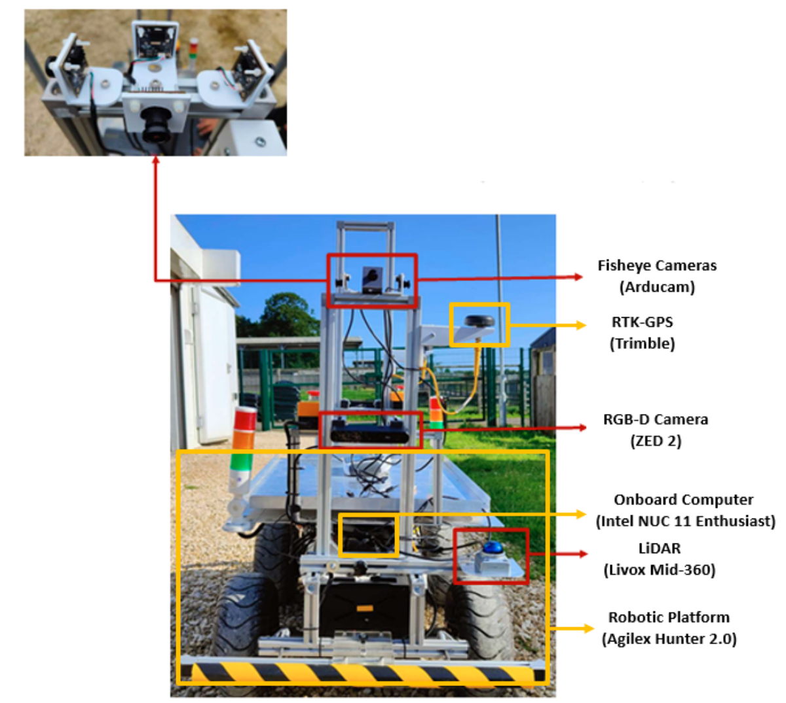
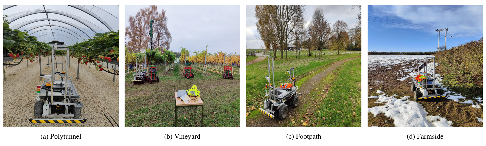

# AGHRI Dataset Tools

This repository provides utilities for preparing the **AGHRI dataset** for perception benchmarks, model training, evaluation, format conversion, and ROS 2 playback.

The README is divided into two parts:

1. **AGHRI Dataset** — an overview of the dataset, sensing platform, environments, annotations, released structure, and sequence naming convention.
2. **Dataset Tools** — instructions for using the conversion and preparation utilities in this repository.

- **AGHRI dataset:** [https://doi.org/10.24385/lincoln.32982638](https://doi.org/10.24385/lincoln.32982638)
- **AGHRI benchmark repository:** [LCAS/AGHRI-dataset-benchmark](https://github.com/LCAS/AGHRI-dataset-benchmark)

> **Important:** The AGHRI dataset is not stored in this Git repository. Download and extract the dataset separately from the DOI above, then use the tools in this repository to prepare the required format.

---

## ▶ Watch the AGHRI Dataset Video

[](https://www.youtube.com/watch?v=nL7mKnMcCzc)

[](https://www.youtube.com/watch?v=nL7mKnMcCzc)

*Click the button above to watch the AGHRI dataset video on YouTube.*

---

# Part I — AGHRI Dataset

## Dataset Overview

**AGHRI** is a multimodal dataset for robot perception of humans in agricultural and off-road environments. It was designed for close-proximity human–robot interaction scenarios in which a compact mobile robot operates around farm workers in cluttered, dynamic, and frequently occluded environments.

The dataset contains synchronised:

- ZED RGB images
- ZED depth maps
- front, left, and right fisheye images
- 3D LiDAR point clouds
- GPS, odometry, yaw, and TF metadata
- camera and camera–LiDAR calibration
- identity-consistent 2D and 3D human annotations
- front-ZED occlusion annotations



**Figure 1.** Example of synchronised multimodal data in AGHRI, including ZED RGB and depth images, left, front, and right fisheye views, and bird’s-eye-view and front-view visualisations of the Livox Mid-360 point cloud.

AGHRI supports research on:

- 2D human detection
- 3D human detection
- 2D multi-object tracking
- 3D multi-object tracking
- person re-identification
- camera–LiDAR fusion

## Dataset at a Glance

| Item | Released dataset |
|---|---:|
| **Dataset summary** | |
| Sequences | 65 |
| Total duration | 1,642.515 s (approximately 27.4 min) |
| Train / validation / test split | 52 / 7 / 6 sequences |
| Participants represented in the release | 10 |
| Approximate released size | 70 GB |
| **All cameras: ZED RGB and fisheye (all three views)** | |
| Camera image frames | 138,741 |
| Annotated camera frames | 93,116 |
| 2D human bounding boxes | 154,002 |
| Camera-specific 2D tracks | 454 |
| **LiDAR** | |
| LiDAR frames | 13,963 |
| Annotated LiDAR frames | 13,799 |
| 3D human bounding boxes | 27,311 |
| 3D tracks | 136 |

The split is created at the **sequence level**, not the frame level, so frames from one recorded sequence do not appear in multiple splits.

## Robotic Platform and Sensors

AGHRI was collected using an **Agilex Hunter 2.0** mobile robot equipped with complementary vision and range sensors. The onboard computer was an **Intel NUC 11 Enthusiast Series** running **Ubuntu 22.04** and **ROS 2 Humble**.

| Sensor | Model | Output used | Field of view | Range | Data rate used |
|---|---|---|---|---|---|
| RGB-D camera | ZED 2 | 672 × 376 RGB and depth | up to 110° H × 70° V × 120° D | 0.3–20 m | 15 fps |
| Fisheye cameras ×3 | Arducam B0261 IMX291 | 640 × 360 images | 175° diagonal | — | 30 fps |
| 3D LiDAR | Livox Mid-360 | 40-line point cloud | 360° × 59° | 0.1–40 m at 10% reflectivity; up to 70 m at 80% reflectivity | 10 Hz |



**Figure 2.** Agilex Hunter 2.0 robotic platform and multimodal sensor setup used for AGHRI data collection, including the ZED 2 RGB-D camera, three Arducam fisheye cameras, Livox Mid-360 LiDAR, and onboard Intel NUC.

## Collection Environments

The dataset was recorded at the University of Lincoln's Riseholme Campus in Lincoln, United Kingdom, between October and November 2024.

It covers four environments:

- strawberry polytunnel
- vineyard
- footpath
- farmside

Recordings include sunny and overcast conditions, with snow present in some polytunnel, footpath, and farmside sessions.



**Figure 3.** AGHRI robotic platform operating in the four data-collection environments: polytunnel, vineyard, footpath, and farmside.

## Activities

AGHRI contains single-person and multi-person sequences covering common movement and agricultural work activities.

### Common activities

- walking
- standing
- talking
- checking or looking at the robot

### Agricultural activities

- pushing a trolley
- carrying a tray
- swapping trays
- picking strawberries
- picking grapes

The robot is recorded in both stationary and moving states.

## Synchronised Multimodal Data

The original data were recorded as ROS 2 bags. The released dataset contains extracted frame-based sensor data so that it can be used directly in offline computer-vision, robotics, and multimodal-learning workflows.

## Annotations and Identities

AGHRI provides 2D and 3D human annotations with participant-level identities that remain consistent across the annotated modalities and across released sequences.

### Annotated modalities

| Modality | Annotated |
|---|---|
| ZED RGB | Yes |
| Front fisheye | Yes |
| Left fisheye | Yes |
| Right fisheye | Yes |
| ZED depth | No |
| Livox LiDAR | Yes |

## Dataset Download and Packaging

The released dataset is approximately 70 GB and is divided into ten downloadable archives:

```text
dataset_part1.zip
dataset_part2.zip
...
dataset_part10.zip
```

Additional files include:

```text
calibration.zip
occlusion_log.csv
dataset_summary.csv
```

Each dataset archive contains one or more released sequence folders ending in `_label`.

`dataset_summary.csv` provides a dataset-level index describing the released sequences and the archive containing each sequence. This allows users to identify and download only the archives required for a particular experiment.

`occlusion_log.csv` provides event-level visibility annotations derived from manual inspection of the **front ZED RGB camera**. Each entry identifies the sequence, participant, occlusion type, start time, duration, and corresponding frame range. The recorded event types are `Partial`, `Total`, and `Total out of frame`.

The `Occlusions` column in `dataset_summary.csv` instead provides a sequence-level description of the **physical sources of occlusion**, such as people, objects, or infrastructure. A value of `none` means that no physical occluder was identified in that sequence. It does not necessarily mean that every person is fully visible in every frame. For example, a person may be partially outside the image because they are very close to the camera or crossing the image boundary. These cases are not classified as physical occlusions in `dataset_summary.csv`, but they may appear as `Partial` events in `occlusion_log.csv`, which records visibility changes and field-of-view truncation in the front ZED RGB view.

## Released Dataset Structure

After the selected archives and calibration files are extracted, the dataset follows the structure below.

```text
dataset_root/
├── calibration/
│   ├── intrinsics.json
│   └── extrinsics.json
│
├── occlusion_log.csv
├── dataset_summary.csv
│
├── footpath1_1walk_1stand_st_11_12_2024_1_label/
│   ├── sensor_data/
│   │   ├── lidar/                  # *.pcd
│   │   ├── cam_fish_left/          # *.png
│   │   ├── cam_fish_front/         # *.png
│   │   ├── cam_fish_right/         # *.png
│   │   ├── cam_zed_rgb/            # *.png
│   │   └── cam_zed_depth/          # *.npy
│   │
│   ├── annotations/
│   │   ├── lidar_ann.json
│   │   ├── cam_fish_left_ann.json
│   │   ├── cam_fish_front_ann.json
│   │   ├── cam_fish_right_ann.json
│   │   └── cam_zed_rgb_ann.json
│   │
│   └── metadata/
│       ├── data_quality_report.json
│       ├── gps_fix.jsonl
│       ├── gps_odom.jsonl
│       ├── odom_global.jsonl
│       ├── odom_local.jsonl
│       ├── yaw.jsonl
│       └── tf/
│           ├── map_to_odom.jsonl
│           └── odom_to_base_link.jsonl
│
├── out_straw_1look_robot_st_11_07_2024_2_label/
│   └── ...
```

The main released formats are:

| Data | Format |
|---|---|
| RGB and fisheye images | `.png` |
| ZED depth maps | `.npy` |
| LiDAR point clouds | `.pcd` |
| Human annotations | `.json` |
| GPS, odometry, yaw, TF, and quality metadata | `.json` and `.jsonl` |
| Calibration | `.json` |
| Occlusion log and dataset summary | `.csv` |

## Sequence and Bag Naming Convention

AGHRI sequence names encode the main scenario information in a compact form. Not every sequence uses every field.

A generally used format is:

```text
<environment>_<number-and-activity-group(s)>_<robot-state>_
<MM_DD_YYYY>_<instance>[_<section>]_label
```

Some names also contain participant and appearance codes, row-relation codes, or additional recording descriptors.

### Environment codes

| Code | Meaning |
|---|---|
| `in_straw` | Inside the strawberry polytunnel |
| `out_straw` | Outside the strawberry polytunnel |
| `in_vine` | Inside the vineyard |
| `out_vine` | Outside the vineyard |
| `footpath1` | Footpath environment |
| `footpath2` | Farmside environment |

### Activity codes

| Code | Meaning |
|---|---|
| `walk` | Walking |
| `stand` | Standing |
| `talk` | Talking |
| `check` | Checking or looking at the robot |
| `push` | Pushing a trolley |
| `carry` | Carrying a tray |
| `swap` | Swapping trays |
| `pick` | Picking strawberries or grapes, depending on the environment |

A number before an activity states how many people perform that activity.

```text
footpath1_2walk+talk...
```

means that two people are walking and talking. The plus sign joins activities performed by the same people.

```text
in_vine_2push_1pick...
```

means that two people are pushing and one person is picking. The underscore separates activity groups involving different participant counts or tasks.

### Row-relation codes

These codes are used for recordings inside polytunnels and vineyards when the relative crop-row position is important.

| Code | Meaning |
|---|---|
| `same` | Participants are in the same row |
| `diff` | Participants are in different rows |

Example:

```text
in_straw_1pick_2push_diff_st_10_31_2024_1_label
```

This identifies a sequence inside the strawberry polytunnel in which one person is picking and two people are pushing in different rows.

### Robot-state codes

| Code | Meaning |
|---|---|
| `st` | Robot stationary |
| `mv` | Robot moving |

### High-visibility clothing descriptor

Some sequence names contain:

| Code | Meaning |
|---|---|
| `ly` | People are wearing high-visibility jackets |

This descriptor is not present in every sequence.


### Recording date

Dates use:

```text
MM_DD_YYYY
```

For example:

```text
11_12_2024
```

means 12 November 2024.

### Extracted recording instance

A final number such as `_1`, `_2`, or `_3` identifies a different extracted instance from the same original ROS 2 recording or general scenario.

Example:

```text
footpath2_2walk+stand_mv_11_20_2024_1
footpath2_2walk+stand_mv_11_20_2024_2
```

`_1` is the first extracted instance and `_2` is the second. They are treated as separate released sequences.

### Section suffix

Final letters such as `_a`, `_b`, and `_c` identify different sections selected from the same recording instance.

Example:

```text
in_vine_2push_1pick_diff_mv_ly_11_06_2024_3_a
in_vine_2push_1pick_diff_mv_ly_11_06_2024_3_b
```

Both names refer to different sections of recording instance `_3`.

### Released annotation suffix

Released extracted and annotated sequence folders end in:

```text
_label
```

For example:

```text
footpath1_p1_yj+mk+gl_1walk+check_mv_11_12_2024_1_label
```

## Footpath Appearance-Change Sequences

The `p1` and `p2` filename identifiers are used specifically in the `footpath1` appearance-change sequences.

| Code | Meaning |
|---|---|
| `p1` | Person 1 |
| `p2` | Person 2 |

These filename identifiers should not be confused with the participant-level global identity values stored in the annotation JSON files.

### Appearance codes used in the released sequences

Only the appearance codes present in the released `footpath1` appearance-change folders are listed here.

| Code | Description |
|---|---|
| `nj` | Normal jacket |
| `yj` | Yellow high-visibility jacket |
| `oj` | Orange high-visibility jacket |
| `sc` | Scarf |
| `ht` | Hat |
| `mk` | Mask |
| `gl` | Glasses |

A plus sign combines clothing and accessory codes.

Example:

```text
footpath1_p1_yj+mk+gl_1walk+check_mv_11_12_2024_1_label
```

This means:

| Token | Meaning |
|---|---|
| `footpath1` | Footpath environment |
| `p1` | Person 1 |
| `yj+mk+gl` | Yellow high-visibility jacket, mask, and glasses |
| `1walk+check` | One person walking and checking the robot |
| `mv` | Robot moving |
| `11_12_2024` | Recorded on 12 November 2024 |
| `_1` | First extracted recording instance |
| `_label` | Released annotated sequence folder |

## Dataset Citation

When using AGHRI, cite the official dataset record shown on the dataset page:

```text
AGHRI: A dataset for multimodal robot perception of humans in
agricultural and off-road environments.
University of Lincoln.
https://doi.org/10.24385/lincoln.32982638
```

Use the DOI page for the current author list, dataset version, and preferred citation format.

---

# Part II — Dataset Tools

## Tools Overview

The utilities in this repository prepare AGHRI for common training, evaluation, and robotics workflows.

| Directory | What it is used for | Guide |
|---|---|---|
| `shared/` | Align camera and LiDAR samples, then create reusable manifests and dataset split files | [`shared/README.md`](shared/README.md) |
| `kitti/` | Export AGHRI data to KITTI-compatible raw, object-detection, depth, and custom multi-camera layouts | [`kitti/README.md`](kitti/README.md) |
| `yolo/` | Prepare image-detection datasets in YOLO format and export session annotations to COCO format | [`yolo/README.md`](yolo/README.md) |
| `mmdet3d/` | Convert AGHRI LiDAR samples and 3D annotations into an MMDetection3D-compatible dataset | [`mmdet3d/README.md`](mmdet3d/README.md) |
| `ros2bag/` | Check AGHRI recordings and generate ROS 2 bags with sensor, calibration, TF, and ground-truth information | [`ros2bag/README.md`](ros2bag/README.md) |
| `converters/` | Run format-specific conversions, including MOT2D, MOT3D, YOLO-to-COCO, and FieldSAFE-to-YOLO | Use each script's `--help` |
| `filters/` | Keep selected human or person classes in supported exported annotation formats | Use each script's `--help` |
| `preprocessing/` | Prepare source data before export, including image undistortion | Use each script's `--help` |

The toolkit folders contain their own instructions because their inputs, dependencies, configuration options, and outputs differ.

## Getting Started

Clone the repository:

```bash
git clone https://github.com/LCAS/AGHRI-dataset-tools.git
cd AGHRI-dataset-tools
```

Define paths for the extracted dataset and generated outputs:

```bash
export DATASET_ROOT="<path-to-extracted-AGHRI-data>"
export OUTPUT_ROOT="<path-for-generated-datasets-or-bags>"
```

There is no single environment or installation command for every folder. Review the relevant local README or the script help before running a toolkit:

```bash
python <path-to-script.py> --help
```

## Synchronisation, Manifests, and Splits

For workflows that require matched multimodal samples, begin with the shared tools:

```bash
python shared/sync_and_match.py "${DATASET_ROOT}" --anchor lidar

python shared/build_manifest_and_splits.py \
    --root "${DATASET_ROOT}" \
    --anchor lidar
```

`sync_and_match.py` creates correspondences between sensor samples around the selected anchor stream.

`build_manifest_and_splits.py` builds reusable dataset records and split information for downstream processing.

See [`shared/README.md`](shared/README.md) for the expected input structure, matching options, and generated files.

## Export Examples

After preparing the required inputs, select the output format needed by the training or evaluation workflow.

### KITTI object-detection layout

```bash
python kitti/kitti_export_object.py \
    --root "${DATASET_ROOT}" \
    --out "${OUTPUT_ROOT}/kitti_object"
```

The `kitti/` folder also contains raw, depth, control, and custom multi-camera exporters.

See [`kitti/README.md`](kitti/README.md).

### YOLO image-detection layout

```bash
python yolo/yolo_export_session.py \
    --root "${DATASET_ROOT}" \
    --out "${OUTPUT_ROOT}/yolo"
```

See [`yolo/README.md`](yolo/README.md) for YOLO and COCO export options.

### MMDetection3D LiDAR layout

Use the MMDetection3D exporter and dataset definition under `mmdet3d/`:

```bash
python mmdet3d/export_agrihuman_to_mmdet3d.py --help
```

See [`mmdet3d/README.md`](mmdet3d/README.md) for the required inputs, output structure, and framework integration.

## Standalone Conversion and Preparation Tools

The smaller utilities can be used independently when a complete toolkit export is not required.

```bash
python converters/gt_to_mot2d.py --help
python converters/gt_to_mot3d.py --help
python converters/yolo_to_coco.py --help
python converters/fieldsafe_rgb_to_yolo.py --help

python filters/filter_to_person.py --help
python preprocessing/undistort_dataset_images.py --help
```

Use `--help` to confirm the accepted formats, required paths, optional arguments, and generated outputs before running a script.

## ROS 2 Bag Generation

For AGHRI ZED RGB and Livox playback, use:

```bash
python ros2bag/check_and_make_rosbag2.py \
    --bag-dir "<path-to-AGHRI-bag-directory>"
```

This is the main AGHRI ROS 2 bag checker and converter in the repository.

Its calibration-aware workflow reads the AGHRI camera intrinsics and camera–LiDAR extrinsics and can write:

- ZED and fisheye `CameraInfo`
- `/tf`
- `/tf_static`
- sensor topics
- ground-truth information required by downstream workflows

The converter preserves the original image and LiDAR timestamps.

Follow [`ros2bag/README.md`](ros2bag/README.md) for the supported modes, topic names, calibration requirements, and verification steps.

## Tools Repository Layout

```text
.
|-- .gitignore
|-- README.md
|-- shared/
|   |-- README.md
|   |-- build_manifest_and_splits.py
|   `-- sync_and_match.py
|-- kitti/
|   |-- README.md
|   |-- kitti_export.yaml
|   |-- kitti_export_common.py
|   |-- kitti_export_ctl.py
|   |-- kitti_export_custom.py
|   |-- kitti_export_depth.py
|   |-- kitti_export_object.py
|   `-- kitti_export_raw.py
|-- yolo/
|   |-- README.md
|   |-- coco_export_session.py
|   `-- yolo_export_session.py
|-- mmdet3d/
|   |-- README.md
|   |-- agri_person_dataset.py
|   `-- export_agrihuman_to_mmdet3d.py
|-- ros2bag/
|   |-- README.md
|   `-- check_and_make_rosbag2.py
|-- converters/
|   |-- fieldsafe_rgb_to_yolo.py
|   |-- gt_to_mot2d.py
|   |-- gt_to_mot3d.py
|   `-- yolo_to_coco.py
|-- filters/
|   `-- filter_to_person.py
|-- preprocessing/
|   `-- undistort_dataset_images.py
`-- notebooks/
```

## Documentation

For the main toolkits, use the folder-specific guides:

- [`shared/README.md`](shared/README.md)
- [`kitti/README.md`](kitti/README.md)
- [`yolo/README.md`](yolo/README.md)
- [`mmdet3d/README.md`](mmdet3d/README.md)
- [`ros2bag/README.md`](ros2bag/README.md)

For scripts without a separate README, run:

```bash
python <script.py> --help
```

## Repository History

The `main` branch brings together tools that were previously maintained across the `v1.0`, `KITTI-converter`, `YOLO-converter`, and `ROS2bag-converter` branches.

The shared synchronisation and manifest tools are stored once under `shared/`, while format-specific instructions remain close to their corresponding exporters.

The earlier branches remain available for development history. New users should normally use `main`.
